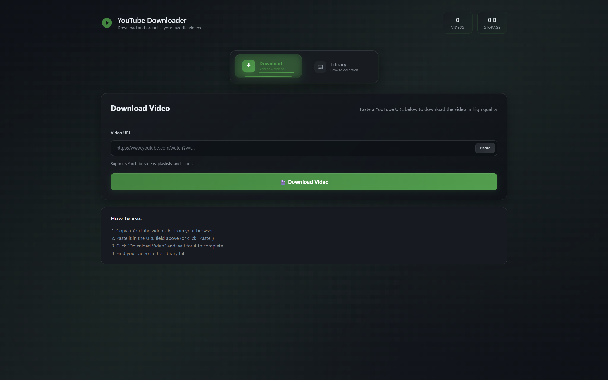

# 🎬 YT Video Downloader & AI Transcriber

[](https://opensource.org/licenses/MIT)
[](https://www.python.org/downloads/)
[](https://flask.palletsprojects.com/)

A modern, full-stack web application that allows you to download YouTube videos and generate AI-powered summaries and transcripts with a beautiful, responsive user interface.



## 📋 Table of Contents

- [⚠️ Disclaimer](#️-disclaimer)
- [🚀 Features](#-features)
- [🛠️ Tech Stack](#️-tech-stack)
- [📂 Project Structure](#-project-structure)
- [⚡️ Installation & Setup](#️-installation--setup)
- [🎯 Usage](#-usage)
- [🧠 How It Works](#-how-it-works)
- [📱 API Endpoints](#-api-endpoints)
- [🔧 Configuration](#-configuration)
- [🐛 Troubleshooting](#-troubleshooting)
- [🌟 UI Highlights](#-ui-highlights)
- [💡 Future Enhancements](#-future-enhancements)
- [🤝 Contributing](#-contributing)
- [📄 License](#-license)
- [🙏 Acknowledgments](#-acknowledgments)

## ⚠️ Legal Disclaimer & Terms of Use

**🚨 CRITICAL LEGAL NOTICE**: This software is provided for **educational and research purposes only**. 

### **Important Legal Boundaries:**

**❌ PROHIBITED USES:**
- Downloading copyrighted content without explicit permission
- Violating YouTube's Terms of Service
- Commercial redistribution of downloaded content
- Bypassing content protection mechanisms
- Any use that infringes intellectual property rights

**✅ LEGITIMATE USES:**
- Educational analysis of publicly available content
- Personal backup of your own uploaded content
- Research and development purposes
- Learning about web scraping and AI technologies
- Fair use analysis (where legally permitted)

### **User Responsibilities:**

By using this software, you acknowledge and agree that:

1. **You are solely responsible** for ensuring your use complies with:
   - YouTube's Terms of Service
   - Copyright laws in your jurisdiction
   - Local and international intellectual property laws
   - Fair use provisions (where applicable)

2. **You will not use this tool** to:
   - Download content without proper authorization
   - Infringe on creators' intellectual property rights
   - Violate platform terms of service
   - Engage in commercial piracy or redistribution

3. **You understand that** the developers:
   - Do not endorse or encourage copyright infringement
   - Are not responsible for your use of this software
   - Provide this tool purely for educational purposes
   - Disclaim all liability for misuse

### **Content Creator Rights**

We strongly support content creators and their rights. If you are a content creator and have concerns about this tool, please contact us for immediate assistance.

**For YouTube Content**: Always respect the creator's wishes and YouTube's policies. When in doubt, don't download.

---

## 🚀 Features

✨ **Core Functionality**
- **YouTube Video Download**: Download videos in multiple quality options (720p, 1080p, best available - Default)
- **AI-Powered Analysis**: Generate intelligent summaries and full transcripts using advanced AI models
- **Smart Storage**: Automatic organization of downloads, summaries, and thumbnails
- **Metadata Extraction**: Complete video information including title, uploader, views, duration, and description
- **Video Management**: Delete videos with all associated files (thumbnails, metadata, summaries)

🎨 **User Experience**
- **Modern UI/UX**: Responsive design with glassmorphism effects and smooth animations
- **Collapsible Sections**: YouTube-style expandable/collapsible video descriptions
- **Tabbed Interface**: Easy switching between AI summary and full transcript views
- **Mobile Responsive**: Optimized for all screen sizes and devices
- **Loading States**: Visual feedback during processing operations

🔧 **Technical Features**
- **Persistent Storage**: Summaries and metadata saved for quick future access
- **Error Handling**: Comprehensive error management with user-friendly messages
- **Performance Optimized**: Efficient video processing and AI analysis
- **RESTful API**: Well-structured backend endpoints for frontend integration

---

## 📂 Project Structure

```
YT-Video-Downloader/
├── app.py                  # Flask backend entry point
├── backend/
│   ├── youtube_downloader.py  # Video download logic
│   └── transcriber.py         # AI transcription & summary logic
├── Downloads/             # Downloaded videos, summaries, thumbnails, Metadata -- Make sure to add this in the root directory
│   └── summaries/
│   └── thumbnails/
├── frontend/
│   ├── index.html         # Home page
│   ├── player.html        # Video player & analysis page
│   └── static/
│       ├── styles.css     # Home page styles
│       ├── player.css     # Player page styles
│       ├── scripts.js     # Home page JS
│       ├── player.js      # Player page JS
└── README.md
```

---

## ⚡️ Installation & Setup

### Prerequisites

- Python 3.8 or higher
- pip (Python package installer)
- Git (for cloning the repository)
- FFmpeg (for video processing)

### Step 1: Clone the Repository

```bash
git clone https://github.com/yourusername/YT-Video-Downloader.git
cd YT-Video-Downloader
```

### Step 2: Create Virtual Environment (Recommended)

```bash
# Create virtual environment
python -m venv venv

# Activate virtual environment
# On Windows:
venv\Scripts\activate
# On macOS/Linux:
source venv/bin/activate
```

### Step 3: Install Dependencies

```bash
pip install -r requirements.txt
```

### Step 4: Environment Configuration

Create a `.env` file in the root directory:

```env
# Groq API Configuration (required for AI summaries)
GROQ_API_KEY=your_groq_api_key_here # Refer to .env.example
```

### Step 5: Run the Application

```bash
python app.py
```

### Step 6: Access the Application

The application opens automatically in a desktop window when you run the script. This happens because of the following code in the main section of `app.py`:

```python
if __name__ == '__main__':
    def run_flask():
        app.run(debug=True, use_reloader=False)

    flask_thread = threading.Thread(target=run_flask)
    flask_thread.daemon = True 
    flask_thread.start() 
    time.sleep(1)

    # Open the desktop window
    webview.create_window(
        'YT Video Downloader & Analyzer',
        'http://127.0.0.1:5000',
        width=1200,
        height=800,
        resizable=True,
        min_size=(800, 600)
    )
    webview.start()
```

This code:
1. Starts the Flask server in a separate thread
2. Creates a desktop window using `webview` that displays the web interface
3. Automatically opens the application window

**Alternative: Web Browser Only**

If you don't want the application to open in a desktop window and prefer to use it only in your web browser, replace the main section of `app.py` with this simpler version:

```python
if __name__ == '__main__':
    app.run(debug=True)
```

Then manually open your web browser and navigate to:
```
http://127.0.0.1:5000
```

The web browser version will work identically to the desktop version, but you'll need to manually open the URL in your preferred browser.

---

## 🎯 Usage

### Basic Workflow

1. **Home Page**: Navigate to the main interface
2. **Enter URL**: Paste a YouTube video URL in the input field
3. **Download**: Click "Download Video" to fetch the video and metadata
4. **View Content**: Navigate to the player page to view your downloaded content
5. **Generate Analysis**: Click "Generate Analysis" to create AI summaries and transcripts
6. **Browse Results**: Switch between summary and transcript tabs

### Supported Video Formats

- MP4 (recommended)
- WebM
- Various quality options (720p, 1080p, best available - Default)

### AI Analysis Features

- **Summary Generation**: Concise, intelligent summaries of video content
- **Full Transcription**: Complete speech-to-text conversion
- **Persistent Storage**: Analysis results saved for future access
- **Fast Retrieval**: Previously analyzed videos load instantly

## 🧠 How It Works

### Video Download Process

1. **URL Validation**: Validates YouTube URL format and accessibility
2. **Metadata Extraction**: Fetches video information (title, duration, uploader, etc.)
3. **Thumbnail Download**: Downloads and stores video thumbnail
4. **Video Download**: Downloads video in optimal quality
5. **File Organization**: Stores files in organized directory structure

### AI Analysis Pipeline

1. **Audio Extraction**: Extracts audio track from downloaded video
2. **Speech Recognition**: Uses OpenAI Whisper for accurate transcription
3. **Content Analysis**: Processes transcript through Groq AI for summary generation
4. **Result Storage**: Saves analysis results for future access
5. **UI Integration**: Displays results in user-friendly interface

## 📱 API Endpoints

### Download Video
```http
POST /download
Content-Type: application/json

{
  "url": "https://www.youtube.com/watch?v=VIDEO_ID"
}
```

**Response:**
```json
{
  "success": true,
  "message": "Video downloaded successfully",
  "filename": "video_filename.mp4",
  "title": "Video Title",
  "thumbnail_url": "/thumbnails/thumbnail.jpg",
  "video_id": "VIDEO_ID",
  "duration": 300,
  "uploader": "Channel Name"
}
```

### Generate Analysis
```http
POST /process_video
Content-Type: application/json

{
  "video_id": "VIDEO_ID"
}
```

**Response:**
```json
{
  "success": true,
  "summary": "AI-generated summary...",
  "transcript": "Full video transcript..."
}
```

### Delete Video
```http
DELETE /delete_video
Content-Type: application/json

{
  "filename": "video_filename.mp4"
}
```

**Response:**
```json
{
  "success": true,
  "message": "Video 'video_filename.mp4' and associated files deleted successfully.",
  "files_deleted": [
    "Video: video_filename.mp4",
    "Metadata file",
    "Info file",
    "Summary file",
    "Thumbnail image"
  ]
}
```

### Get Downloaded Videos
```http
GET /videos
```

**Response:**
```json
{
  "videos": [
    {
      "video_id": "VIDEO_ID",
      "title": "Video Title",
      "filename": "video_filename.mp4",
      "thumbnail": "/thumbnails/thumbnail.jpg"
    }
  ]
}
```

## 🔧 Configuration

### Environment Variables

| Variable | Description | Required | Default |
|----------|-------------|----------|---------|
| `GROQ_API_KEY` | API key for Groq AI service | Yes | None |

### Groq API Setup

1. Visit [Groq Console](https://console.groq.com)
2. Create an account and generate an API key
3. Add the key to your `.env` file

### FFmpeg Installation

**Windows:**
```bash
# Using Chocolatey
choco install ffmpeg

# Or download from https://ffmpeg.org/download.html 
```

**macOS:**
```bash
# Using Homebrew
brew install ffmpeg
```

**Ubuntu/Debian:**
```bash
sudo apt update
sudo apt install ffmpeg
```

## 🐛 Troubleshooting

### Common Issues

**Issue: "FFmpeg not found"**
```
Solution: Install FFmpeg and ensure it's in your system PATH
```

**Issue: "Groq API key not configured"**
```
Solution: Add GROQ_API_KEY to your .env file
```

**Issue: "Permission denied when creating directories"**
```
Solution: Run with appropriate permissions or change download directory location
```

**Issue: "Video download fails"**
```
Solution: 
1. Check internet connection
2. Verify YouTube URL is valid and accessible
3. Ensure video is not private or restricted
```

**Issue: "AI analysis takes too long"**
```
Solution:
1. Check Groq API status
2. Verify API key is valid
3. Ensure stable internet connection
```

### Debug Mode

Enable debug mode for detailed error messages by running:

```bash
python app.py --debug
```

### Logs

Application logs will be displayed in the console during development.

---

## 🛠️ Tech Stack

**Frontend**
- HTML5, CSS3 (Glassmorphism design, CSS Grid/Flexbox)
- Vanilla JavaScript (ES6+, Fetch API, DOM manipulation)
- Responsive design principles

**Backend**
- Python 3.8+ with Flask 3.1.1
- RESTful API architecture
- File system management for media storage

**AI & Media Processing**
- OpenAI Whisper for speech-to-text transcription
- Groq API for AI-powered summary generation
- yt-dlp for YouTube video downloading
- MoviePy for video processing

**Dependencies**
```
Flask==3.1.1
groq==0.28.0
moviepy==1.0.3
openai_whisper==20240930
python-dotenv==1.1.1
Requests==2.32.4
yt_dlp==2025.6.9
```

---

## 🌟 UI Highlights

### Design Features
- **Glassmorphism Effects**: Modern frosted glass aesthetic with backdrop blur
- **Gradient Backgrounds**: Dynamic, visually appealing background gradients
- **Responsive Layout**: Seamless experience across desktop, tablet, and mobile devices
- **Smooth Animations**: CSS transitions and hover effects for enhanced interactivity

### Interactive Elements
- **Collapsible Descriptions**: YouTube-style expandable video descriptions
- **Tabbed Interface**: Smooth transitions between summary and transcript views
- **Loading States**: Visual feedback during video processing and AI analysis
- **Sticky Video Player**: Centered, responsive video player with custom controls

### User Experience
- **Intuitive Navigation**: Clear, logical user flow from download to analysis
- **Visual Feedback**: Progress indicators and status messages
- **Error Handling**: User-friendly error messages with actionable suggestions
- **Accessibility**: Keyboard navigation and screen reader compatibility

## 💡 Future Enhancements

### Planned Features
- **Multi-language Support**: Leverage Whisper's multilingual capabilities for global accessibility
- **Advanced AI Analysis**: 
  - Sentiment analysis of video content
  - Topic extraction and categorization
  - Key moments and highlights detection
- **Export Functionality**: 
  - PDF export for summaries and transcripts
  - TXT file downloads
  - JSON data export for integration
- **Batch Processing**: 
  - Playlist download support
  - Multiple video analysis
  - Queue management system

### Technical Improvements
- **Performance Optimization**:
  - Background processing for large videos
  - Caching layer for frequently accessed content
  - Progressive loading for better UX
- **Enhanced Storage**:
  - Database integration for metadata
  - Cloud storage options
  - Search and filtering capabilities
- **Security Enhancements**:
  - User authentication system
  - Rate limiting for API endpoints
  - Input validation and sanitization

### UI/UX Enhancements
- **Dark/Light Theme Toggle**
- **Customizable Dashboard**
- **Advanced Search Functionality**
- **Video Collections and Playlists**
- **Social Sharing Features**

---

## 🤝 Contributing

We welcome contributions from the community! Here's how you can help:

### How to Contribute

1. **Fork the Repository**
   - Click the "Fork" button on the GitHub repository page, or use:
   ```bash
   gh repo fork https://github.com/yourusername/YT-Video-Downloader.git
   ```

2. **Clone Your Fork**
   ```bash
   git clone https://github.com/yourusername/YT-Video-Downloader.git
   cd YT-Video-Downloader
   ```

3. **Create a Feature Branch**
   ```bash
   git checkout -b feature/your-feature-name
   ```

4. **Make Your Changes**
   - Follow the existing code style
   - Add comments for complex logic
   - Update documentation if needed

5. **Test Your Changes**
   ```bash
   # Run the application and test thoroughly
   python app.py
   ```

6. **Commit Your Changes**
   ```bash
   git add .
   git commit -m "Add: your feature description"
   ```

7. **Push to Your Fork**
   ```bash
   git push origin feature/your-feature-name
   ```

8. **Create a Pull Request**
   - Go to your fork on GitHub
   - Click "New Pull Request"
   - Provide a clear description of your changes
   - Include screenshots for UI changes
   - Reference any related issues

### Contribution Guidelines

- **Code Quality**: Ensure your code follows Python PEP 8 standards
- **Documentation**: Update README.md and inline comments as needed
- **Testing**: Test your changes thoroughly before submitting
- **Commit Messages**: Use clear, descriptive commit messages
- **Issue Reports**: Use the issue templates when reporting bugs or requesting features

### Areas for Contribution

- 🐛 Bug fixes and error handling improvements
- ✨ New features and enhancements
- 📚 Documentation improvements
- 🎨 UI/UX enhancements
- 🔧 Performance optimizations
- 🧪 Testing and quality assurance

### Development Setup

1. Follow the installation instructions
2. Set up your Groq API key in `.env`
3. Make your changes
4. Test thoroughly
5. Submit your pull request

---

## 📄 License

This project is licensed under the MIT License - see the [LICENSE](LICENSE) file for details.

### **Important License Clarifications**

**The MIT License applies ONLY to the source code of this application, NOT to:**
- Downloaded YouTube content (which remains under YouTube's and creators' ownership)
- The act of downloading copyrighted material
- Any violation of third-party terms of service

**License Scope:**
- ✅ **Covers**: The application source code, documentation, and software components
- ❌ **Does NOT cover**: YouTube content, third-party media, or authorization to download copyrighted material

**Developer Liability:**
The MIT License includes standard disclaimers that the software is provided "AS IS" without warranty. The developers are not responsible for how users choose to use this tool.

### MIT License Summary

- ✅ Commercial use (of the source code)
- ✅ Modification (of the source code)
- ✅ Distribution (of the source code)
- ✅ Private use (of the source code)
- ❌ Liability (for misuse by end users)
- ❌ Warranty (software provided as-is)

## 🙏 Acknowledgments

### Open Source Libraries
- **[yt-dlp](https://github.com/yt-dlp/yt-dlp)** - Powerful YouTube video downloader
- **[OpenAI Whisper](https://github.com/openai/whisper)** - Robust speech recognition system
- **[Flask](https://flask.palletsprojects.com/)** - Lightweight and flexible web framework
- **[MoviePy](https://zulko.github.io/moviepy/)** - Video editing and processing library

### AI Services
- **[Groq](https://console.groq.com)** - High-performance AI inference for summaries

### Design Inspiration
- **YouTube** - UI patterns and user experience principles
- **GitHub** - Documentation structure and design elements
- **Modern Web Design Trends** - Glassmorphism and responsive design patterns

### Special Thanks
- Content creators and the open-source community
- Contributors and users who provide feedback and suggestions
- Educational institutions promoting responsible technology use

---

<div align="center">

**Made with ❤️ by [Jashan](https://jashanpreetsingh.tech)**

*For productivity, learning, and fun!*

[](https://github.com/JashanMaan28)
[](https://jashanpreetsingh.tech)

</div>
